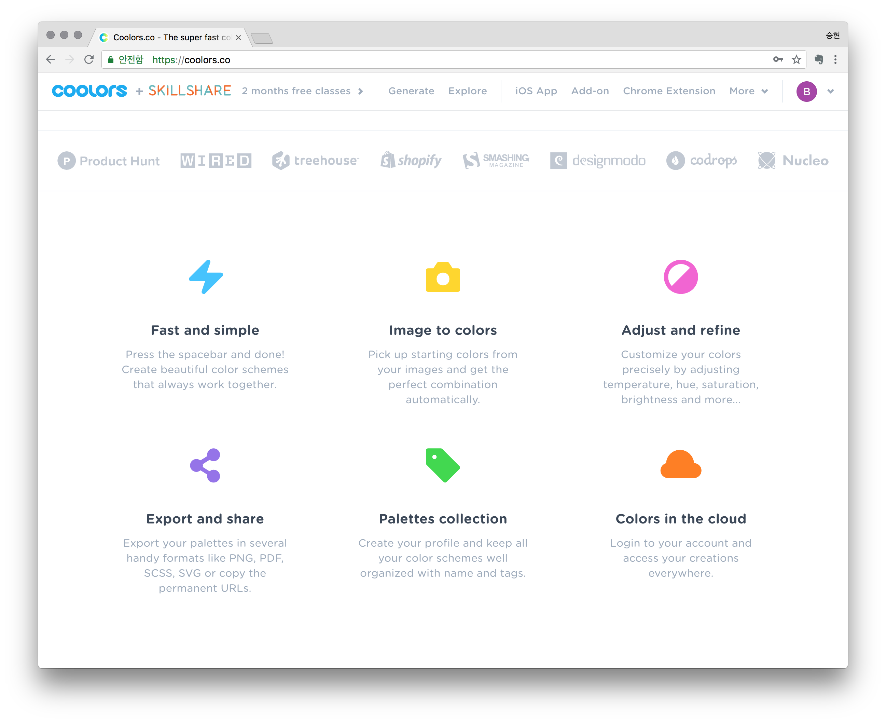

# 컬러 선택이 고민스럽다면 coolors.co

개인 블로그를 만들던 앱을 만들던 무엇인가의 디자인을 할 때는 항상 컬러가 문제이기 마련입니다.

어떤 색상이 서로 어울리는지는 디자인을 전공한 저 역시 늘 고민거리인데요

그런 고민을 획기적으로 줄일수 있는 사이트가 있어서 소개합니다.

coolors 가 말하는 주요 기능들 입니다. 

잠깐 사용해 보니 무척 편리하고 유용해 보이네요.

## 기본 화면

기본적인 제너레이트 화면입니다.

기본적으로 5가지의 색상을 제안해주는데 사용방법은 그저 'space' 키만 클릭하면 됩니다.

자동으로 색상이 변하면서 추천을 해줍니다. 

특정 색상이 마음에 들어 고정시키면 해당 색상을 제외한 다른 색상들만 어울리는 색상으로 추천해 줍니다. 

(사용법이 워낙 간편해서 이것 저것 몇번 눌러보면 금방 이해가 될 겁니다.)

## 이미지에서 색상 추출

대부분 디자이너들이 작업 초기에 색상 계획을 잡아놓는 편인데 이럴때 여러가지 소스들을 이용해서 자료를 수집하고 계획합니다. 

사진을 이용하여 사용된 색상을 참고하는 경우도 많은데요 coolors 에서는 이미지를 이용하여 색상을 추출할 수 있는 기능을 제공합니다.

이미지는 로컬에 저장된 이미지도 되고 인터넷에 있는 이미지 주소로도 사용할 수 있습니다.

원하는 사진을 넣으면 알아서 메인색상을 정하고 제너레이트 해줍니다. 

'Auto' 를 누르면 메인색상을 각 지점으로 이동하여 새로운 색상을 추천해 줍니다.

'Collage'를 눌러 자신의 컴퓨터로 다운 받을수도 있습니다.

## 내보내기

원하는 색상의 배열을 찾았다면 파렛트를 내보내기하여 다양하게 사용할 수 있습니다.

pdf나 css, png 포멧으로 내보낼수 있으며 재미있게도 코픽마커용으로 내보낼수도 있습니다.  

또한 어도비의 애드온(5달러)을 구입하면 포토샵이나 일러스트에서 사용할 수 있는 팔렛트로 내보낼수도 있습니다.

## 파렛트 저장과 공유

간단한 회원가입을 통해서 나만의 파렛트를 저장하고 남들과 공유할 수 있습니다.

내가 저장해 놓은 나만의 파렛트를 프로젝트별로 만들어 둔다면 아주 유용하게 사용할 수 있을것 같네요.

남들이 저장해 놓은 파렛트도 구경할 수 있습니다. 아이디어가 필요할 때 한번씩 훝어보면 좋을것 같네요.

항상 색상은 고민입니다. 

워낙에 개인차도 심한 부분이고 디바이스 환경에 따라서 달라보이기도 하고 또 인쇄물에 따라서 다르기도 하고..

이 사이트는 아무래도 그런 고민이 있는 디자이너가 만들지 않았을까 하는 생각도 해보면서 마칩니다.

 

 

 