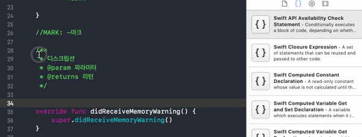
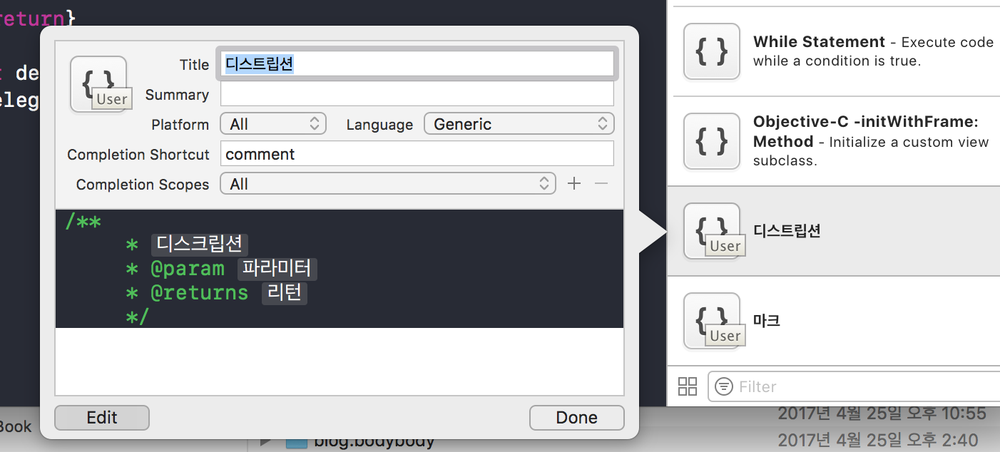
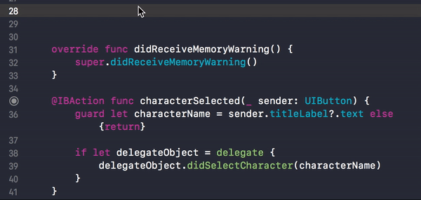

### 자주 사용하는 코드 뭉치들 코드 스니펫에 저장하기

---

먼저 아래와 같이 원하는 코드블록 등을 에디터 화면에 입력합니다.

~~~swift
    /**
     * 디스크립션
     * @param 파라미터
     * @returns 리턴
     */
~~~

이후 해당 블록을 선택하고 마우스 왼쪽 클릭한 상태로 드래그하여 우측 코드스니펫 창에 옮깁니다.

이후 해당하는 코드스니펫을 선택하고 에디트를 눌러 원하는 이름과 설명, 숏컷등을 정합니다.

Language를 스위프트로 변경 후에 Completion Scoopes 에서 적용 범위를 골라서 적용할 수 있습니다.

또한 그림처럼 해당 타이틀이나 파라미터, 리턴 등을 변수로 바로 입력가능하게 하려면

~~~
변수로 만들기를 원하는 부분을 <# #>로 감싸 아래처럼 입력합니다.
<#디스크립션#>
~~~

이제 위에 정해놓은 것처럼 comment를 입력하면 저의 코드뭉치가 나오게 됩니다.

해당 기능은 에디터 창의 어떤 코드라도 코드스니펫으로 만들 수 있는것 같습니다.

### 팁!

코드 선택하고 드래그할 때 왼쪽 버튼만 누르면 선택이 해제되어 버리는 경우가 많은데 영역을 선택한 후에 바로 왼쪽 클릭을 하지 말고 잠시 뜸을 들인후 조심스럽게(?) 왼쪽 버튼을 클릭해야 선택영역이 풀리지 않고 코드스니펫 창에 던져 넣을 수 있네요.